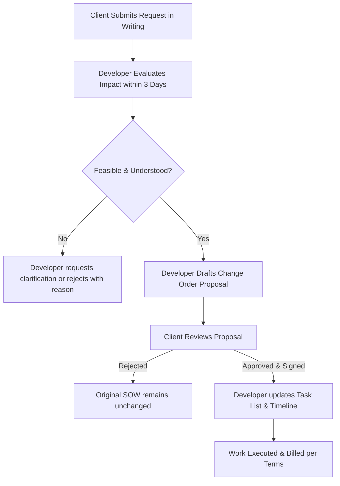

# SCOPE CHANGE & CHANGE REQUEST POLICY

This Scope Change and Change Request Policy (the "Policy" or "Clause") is entered into and made effective as of **June 21, 2026** (the "Effective Date"), by and between:

1. **Rahul Sharma**, representing **Health Matters**, having its principal place of business in **Surat, Gujarat, India** (hereinafter referred to as the "Client"); and
2. **Aangan Developers** (hereinafter referred to as the "Developer").

The Client and the Developer are collectively referred to as the "Parties" and individually as a "Party."

This Policy is incorporated into and forms an integral part of the primary agreement (including the Scope of Work (SOW) Sign-off, Proposal, Payment Terms Agreement, and NDA) governing the design, development, and deployment of the **Health Matters web platform** (the "Project" or "Platform").

---

## 1. Purpose & Scope of Policy

### 1.1 Scope Boundaries
The baseline scope of the Project is defined strictly by the executed [Scope of Work (SOW) & Deliverables Agreement](file:///Users/tithishah/Documents/AanganDevelopers/HealthMatters/scope_of_work_signoff.md). Any feature, page, integration, or design element not explicitly documented in the SOW is considered outside the current scope.

### 1.2 Purpose of Policy
This Policy establishes a clear, mutually beneficial procedure for submitting, evaluating, pricing, and implementing modifications to the SOW (each, a "Change"). It ensures that:
- The Client has a clear mechanism to request improvements, new features, or modifications.
- The Developer is fairly compensated for additional effort, research, and coding.
- Project timelines, deployment schedules, and resource allocations are adjusted realistically.
- Unnecessary delays and misunderstandings ("scope creep") are avoided.

---

## 2. Classification of Scope Changes

To streamline project management, changes are categorized into two types:

### 2.1 Minor Adjustments
A "Minor Adjustment" is defined as any modification that:
- Requires less than **one (1) hour** of total developer or designer effort.
- Does not affect the underlying database schema, API integrations, or core backend structure.
- Examples include: Simple text corrections, replacement of client-supplied images, small CSS font styling or color tweaks, and link updates.
- **Treatment:** The Developer will perform up to three (3) Minor Adjustments during the active development phase free of charge. Any additional minor adjustments will be compiled and billed at the standard rate or treated as a formal Change Request.

### 2.2 Major Changes (Scope Changes)
A "Major Change" is defined as any modification that:
- Requires **more than one (1) hour** of developer, designer, or tester effort.
- Introduces new pages, sections, or user paths not explicitly detailed in the SOW (e.g., adding a new wellness pillar page, adding interactive tools, etc.).
- Requires database modifications, new API integrations, third-party plugin configurations, or structural changes to the code.
- Re-architects or reverses already approved layouts, designs, or functional components.
- **Treatment:** Must go through the formal Change Request Process outlined in Section 3 of this document and will be subject to additional fees and timeline extensions.

---

## 3. Formal Change Request Process

Any Major Change must follow the structured workflow below:

### 3.1 Step 1: Request Submission
The Client must submit all Change Requests in writing (via email or official project messaging channels) to the Developer. The request must describe:
- The desired feature, change, or modification.
- The business objective or user action it facilitates.
- Any relevant assets (copy, designs, reference links) needed to understand the request.

### 3.2 Step 2: Impact Assessment
Upon receipt of the request, the Developer will analyze the technical and resource implications. Within **three (3) business days**, the Developer will estimate:
- The number of hours required for design, coding, testing, and deployment.
- The impact on the existing system architecture and stability.
- The estimated timeline delay or extension required.

### 3.3 Step 3: Change Order Proposal
The Developer will issue a formal document (a "Change Order") to the Client detailing:
- The exact specifications of the requested Change.
- The additional fixed-cost fee or hourly estimate.
- The revised project delivery timeline and launch date.
- The payment schedule for the Change.

### 3.4 Step 4: Approval & Authorization
No work on the requested Change will commence, and the Developer is under no obligation to perform such work, until both Parties have signed and dated the Change Order. Upon mutual sign-off, the Change Order is annexed to the SOW, and the new scope is authorized.

---

## 4. Billing, Pricing & Payment Terms

### 4.1 Billing Options
Change Orders will be priced using one of the following methods, as agreed in the specific Change Order:
- **Flat-Rate / Fixed Fee:** A single consolidated price for the entire scope of the change. (Preferred for well-defined features).
- **Time & Materials (Hourly):** Billed at the Developer's standard rate of **INR 1,500 per hour** (or as otherwise specified in the Change Order), documented with time sheets.

### 4.2 Minimum Billing Increment
To cover setup, context switching, and deployment overhead, the minimum billing increment for any approved Change Order is **two (2) hours** (INR 3,000).

### 4.3 Payment Schedule for Change Orders
Unless specified otherwise in the Change Order, additional fees will be billed as follows:
- **50% Upfront Deposit:** Due immediately upon signing the Change Order and before work begins.
- **50% Balance:** Due upon completion and client sign-off of the change, prior to deployment to production or staging.

---

## 5. Timeline Adjustments & Extensions

### 5.1 Automatic Extension
Any approved Change Order automatically extends the overall Project milestones and final delivery date by the number of working days specified in the Change Order.

### 5.2 Suspended Timelines during Evaluation
While a Change Request is under evaluation by the Developer or pending signature by the Client, any project milestones directly dependent on or affected by the proposed change will be put on hold. The Developer shall not be liable for any delays in the original SOW schedule caused by the evaluation or negotiation of a proposed Change.

---

## 6. Cancellation of Change Requests

If the Client decides to cancel a Change Request or Change Order after authorization:
- The Client must notify the Developer in writing immediately.
- The Client remains liable to pay for all hours worked and expenses incurred by the Developer on the change up to the date of receipt of the cancellation notice.
- If a Flat-Rate Change Order is cancelled mid-way, the Developer will bill proportionally based on the percentage of completion, as determined in good faith by the Developer.
- Any upfront deposit paid for a cancelled Change Order is non-refundable.

---

## 7. Governing Law & Dispute Resolution

This Policy and all Change Orders issued hereunder shall be governed by and construed in accordance with the laws of **India**, with exclusive jurisdiction vested in the courts of **Surat, Gujarat, India**. Any disputes arising out of a Change Order shall be subject to the resolution mechanisms defined in the primary agreement.

---

## 8. Acceptance & Authorization

By signing below, the Parties agree to adhere to the scope change and change request guidelines outlined in this Policy.

  

<table style="width: 100%; border: none;">
  <tr style="border: none;">
    <td style="width: 50%; border: none; padding-right: 20px;">
      <strong>Prepared By:</strong> Aangan Developers  
      ____________________________________ 
      Authorized Representative 
      Date: June 21, 2026
    </td>
    <td style="width: 50%; border: none; padding-left: 20px;">
      <strong>Approved By:</strong> Health Matters (Client)  
      ____________________________________ 
      Rahul Sharma, Founder 
      Date: June 21, 2026
    </td>
  </tr>
</table>
